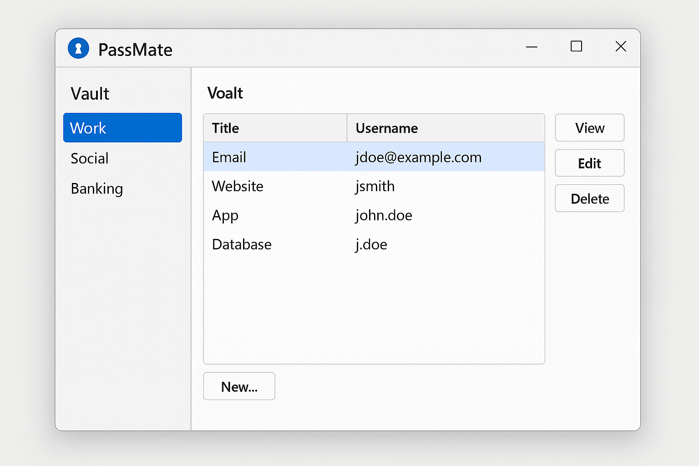

#  &nbsp; PassMate &nbsp; 


> **A sleek password manager inspired by Microsoft’s clean UI, built with JavaFX and modern Java.**

---

<div align="center">
   
</div>

---

## 🚀 Features

- 🔒 **Secure Vault** with categorized folders
- 🎨 Sleek, minimalist UI inspired by Microsoft apps
- 🔐 Planned AES encryption (coming soon)
- 📋 Copy, view, and autofill passwords
- 🔗 Token & QR code-based password sharing (future)
- 🎓 A hands-on Java & JavaFX learning project

---

## 📦 Tech Stack

<div align="center">

   

   
   
   
   

</div>

---

## 🎯 Roadmap

| **Phase** | **Feature**                      | **Status**       |
|-----------|----------------------------------|------------------|
| **P0**    | Project setup (Maven, JavaFX)    | ✅ Completed      |
| **P1**    | Vault + Category structure       | ✅ Completed     |
| **P2**    | Password model + AES encryption  | 🔄 In Progress    |
| **P3**    | Microsoft-style JavaFX UI        | ⏳ Upcoming       |
| **P4**    | CRUD operations for passwords    | ⏳ Upcoming       |
| **P5**    | Clipboard copy / view features   | ⏳ Upcoming       |
| **P6**    | Autofill & "Apply" functionality | ⏳ Upcoming       |
| **P7**    | Token / QR sharing logic         | ⏳ Upcoming       |
| **P8**    | Custom domain decoder API        | 🔮 Future         |

<div align="center">
   
</div>

---

## 🛠 Getting Started

### Prerequisites

- **Java 17 or higher** (Java 24 recommended)
- **Maven 3.6+**
- **JavaFX SDK 21** installed and configured

### Run Locally

1. Clone the repository:
   ```bash
   git clone https://github.com/yourusername/passmate.git
   cd passmate
   ```

2. Open the project in **IntelliJ IDEA** (or your preferred IDE).

3. Build the project with **Maven**:
   ```bash
   mvn clean install
   ```

4. Run the app with the correct JavaFX modules:
   ```bash
   java --module-path /path/to/javafx-sdk-21/lib --add-modules javafx.controls,javafx.fxml -jar target/passmate.jar
   ```

> ⚠️ Replace `/path/to/javafx-sdk-21/lib` with your JavaFX SDK path.

---

## 🤝 Contributing

Contributions, issues, and feature requests are welcome!  
Feel free to fork the repository and submit pull requests.

---

## 📄 License

> **MIT License** © 2025 [Senan Qulamov](https://github.com/senanqulamov)  
> Made with ❤️ and Java by **Senan, The 48 Team**

---

## 📞 Contact

For any questions or suggestions, please reach out:
- **GitHub**: [Senan Qulamov](https://github.com/senanqulamov)
- **LinkedIn**: [Senan Qulamov](https://www.linkedin.com/in/senan-qulamov/)

